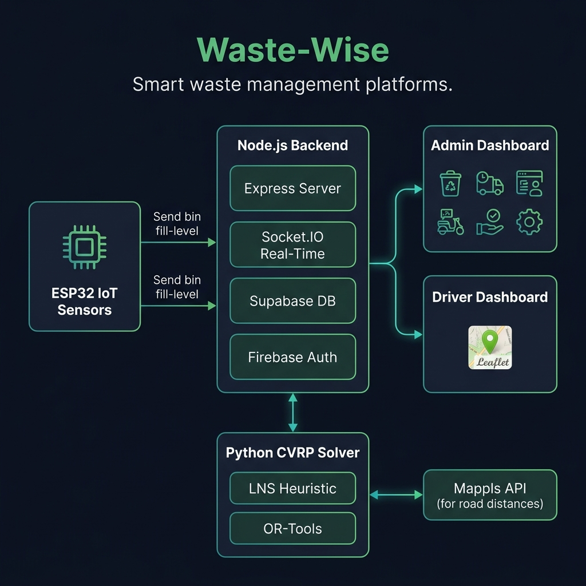

<div align="center">

# ♻️ Waste-Wise

### Smart Logistics & CVRP Routing Platform

*Full-stack waste management with mathematical route optimization, real-time IoT, and Firebase auth*

[](https://github.com/chahat1709/Waste-Wise)
[](https://developer.mozilla.org/en-US/docs/Web/JavaScript)
[](https://python.org)
[](https://firebase.google.com/)

</div>

---

## ⚡ What is Waste-Wise?

Waste-Wise is a **full-stack waste management and logistics platform** that solves one of operations research's hardest problems — the **Capacitated Vehicle Routing Problem (CVRP)** — and connects the mathematical solver to a real-time IoT monitoring system.

Instead of using manual route planning or blocking batch jobs, Waste-Wise implements:
- **Dual CVRP solver** — custom Large Neighborhood Search (LNS) heuristic + Google OR-Tools integration
- **Real-time IoT ingestion** from ESP32 sensors monitoring bin fill levels
- **Event-driven rerouting** via Socket.IO for instant fleet adaptation
- **Full auth system** with Firebase Authentication and Supabase persistence

> **Built by a 17-year-old, entirely self-taught systems engineer.**

---

## 🔬 Research Context

| | |
|---|---|
| **Problem** | Monolithic solvers for CVRP execute as blocking batch jobs, incapable of adapting dynamically to real-time IoT trigger events |
| **Hypothesis** | An event-driven architecture coupling a Python LNS heuristic directly to a Socket.IO real-time event bus will enable near-instantaneous stateful fleet rerouting |
| **Goal** | Reduce dynamic fleet rerouting latency by >85% compared to traditional cron-job implementations |
| **Status** | Dual solver operational with real-time dashboard. Mappls road-distance API integrated with Haversine fallback |

---

## 🏗️ Architecture

<div align="center">



</div>

### System Flow

```
┌──────────────┐        ┌────────────────────────────────────┐
│  ESP32 IoT   │───────▶│        NODE.JS BACKEND              │
│  Sensors     │  data  │  ┌──────────────────────────────┐  │
│  (bin fill)  │        │  │ Express Server (1000+ lines) │  │
└──────────────┘        │  ├──────────────────────────────┤  │
                        │  │ Socket.IO Real-Time Events   │  │
                        │  ├──────────────────────────────┤  │
                        │  │ Supabase (Persistence)       │  │
                        │  ├──────────────────────────────┤  │
                        │  │ Firebase Auth (Sessions)     │  │
                        │  └──────────────────────────────┘  │
                        └─────────┬──────────────┬───────────┘
                                  │              │
                    ┌─────────────▼──┐    ┌──────▼──────────┐
                    │ ADMIN DASHBOARD │    │ DRIVER DASHBOARD │
                    │ Fleet Mgmt     │    │ Leaflet Maps     │
                    │ Route Assign   │    │ Collection Logs  │
                    │ Bin Monitoring  │    │ Hazard Alerts    │
                    └────────────────┘    └─────────────────┘
                                  │
                    ┌─────────────▼──────────────────┐
                    │     PYTHON CVRP SOLVER          │
                    │  ┌───────────┐  ┌────────────┐ │
                    │  │ LNS       │  │ Google     │ │
                    │  │ Heuristic │  │ OR-Tools   │ │
                    │  └───────────┘  └────────────┘ │
                    │  Mappls API ◄── Haversine       │
                    └─────────────────────────────────┘
```

---

## 🎯 Core Features

| Feature | Description |
|---------|-------------|
| **Dual CVRP Solver** | Custom LNS heuristic + Google OR-Tools for capacitated vehicle routing |
| **Real-Time IoT** | ESP32 sensor data ingestion for live bin fill-level monitoring |
| **Event-Driven Rerouting** | Socket.IO event bus triggers instant fleet re-optimization |
| **Admin Dashboard** | Full fleet management, route assignment, and bin monitoring panel |
| **Driver Dashboard** | Real-time Leaflet maps, route visualization, collection confirmation |
| **Auth System** | Firebase Authentication with HTTP-only session cookies |
| **Road Distance API** | Mappls (MapmyIndia) integration with Haversine fallback |

---

## 📂 Project Structure

```
Waste-Wise/
├── server.js              # Node.js Express backend (1000+ lines)
├── app.js                 # App initialization
├── cvrp_solver.py         # Python CVRP solver (LNS + OR-Tools)
├── config.js              # Server configuration
├── firebase-Config.js     # Firebase configuration
├── firebase-auth.js       # Authentication logic
├── firebase-config-unified.js  # Unified Firebase config
├── login-auth.js          # Login authentication
├── signup-auth.js         # Signup authentication
├── dashboard.html         # Driver dashboard
├── dashboard.js           # Dashboard logic
├── dashboard.css          # Dashboard styles
├── admindashboard.html    # Admin dashboard
├── adminDashboard.js      # Admin dashboard logic
├── admin.html             # Admin panel
├── admin.js               # Admin logic
├── binStatus.html         # Bin status monitor
├── binstatus.js           # Bin status logic
├── GaugeView.js           # Visual gauge components
├── index.html             # Landing page
├── login.html             # Login page
├── signup.html            # Signup page
├── Translate.js           # Multi-language support
├── requirements.txt       # Python dependencies
└── package.json           # Node.js dependencies
```

---

## 🛠️ Tech Stack

| Layer | Technology | Purpose |
|-------|-----------|---------|
| **Algorithm** | Python (LNS, OR-Tools, Haversine) | CVRP route optimization |
| **Backend** | Node.js, Express, Socket.IO | Real-time server & API |
| **Database** | Supabase | Persistent data storage |
| **Auth** | Firebase Admin SDK | User authentication & sessions |
| **Frontend** | Vanilla JS, Leaflet.js, HTML5/CSS3 | Dashboards & maps |
| **IoT** | ESP32 | Sensor data from smart bins |
| **Maps** | Mappls (MapmyIndia) API | Road distance calculations |

---

## 🚀 Quick Start

### Prerequisites
- **Node.js** 18+
- **Python** 3.10+
- **Firebase** project with Authentication enabled
- **Supabase** project with database configured

### Setup

```bash
# Clone the repository
git clone https://github.com/chahat1709/Waste-Wise.git
cd Waste-Wise

# Install Node.js dependencies
npm install

# Install Python dependencies (for CVRP solver)
pip install -r requirements.txt

# Configure Firebase
# Edit firebase-Config.js with your Firebase project credentials

# Start the server
node server.js
```

Then open `http://localhost:3000` in your browser.

---

## 📝 License

Research & Educational Use

---

<div align="center">

**Built with obsession by [Chahat Jain](https://github.com/chahat1709)**

*17-year-old self-taught systems engineer | India*

[LinkedIn](https://www.linkedin.com/in/chahat-jain-20873b377) · [GitHub](https://github.com/chahat1709) · [Email](mailto:chahatjain0-96@gmail.com)

</div>
